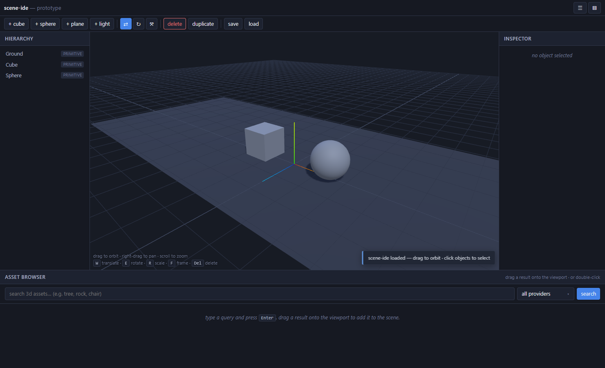

# clag

> **Collage 3D engine** — uma engine 3D leve no browser focada em montar cenas como **colagem de assets públicos**, com pipeline 100% JavaScript e zero build step.

🧪 **Preview:** [st.did.lu/scene-ide/v2](https://st.did.lu/scene-ide/v2/index.html) (deploy oficial em `clag.did.lu` quando estabilizar)



---

## Por que `clag`

Montar uma cena 3D pra mockup hoje é fragmentado: Blender + Sketchfab + Poly Haven + 8 abas. clag colapsa o fluxo em um editor no browser — digita "tree", arrasta o resultado pra cena, engine baixa e posiciona.

Não é Blender. Não é Unity. É um editor de **colagem 3D** — rápido pra rascunhar.

Análise de mercado, comparáveis e viabilidade como produto: [docs/PRODUCT-NOTES.md](./docs/PRODUCT-NOTES.md).

## O que tem hoje (PoC)

- **Viewport 3D** com [three.js](https://threejs.org) + `TransformControls` (W/E/R/F/Del/Ctrl+D)
- **Hierarchy** + **Inspector** editável (transform, material, light)
- **Asset browser multi-provider**: busca paralela em [Poly Haven](https://polyhaven.com) (CC0, sem auth), [Khronos glTF Samples](https://github.com/KhronosGroup/glTF-Sample-Assets) (catálogo curado), e [Sketchfab](https://sketchfab.com) (search anônima)
- **Drag-to-scene** e double-click pra adicionar assets
- **Save/load** scene em localStorage (re-baixa assets pelo `assetMeta`)
- **Zero build step** — vanilla ES modules + importmap, CDN jsdelivr

## Princípios

Resumo (detalhe em [docs/PRINCIPLES.md](./docs/PRINCIPLES.md)):

1. **JavaScript-first, sem build step.** Nada de Vite, nada de bundler. ES modules nativos + importmap. Editar `.js`, dar F5, ver.
2. **Assets públicos como cidadão de primeira classe.** Toda biblioteca livre digna de nota deveria ser pesquisável de dentro da engine — não acessada via 8 abas no Chrome.
3. **Pipeline simples acima de tudo.** A engine não tenta competir com Unity em features. Compete em **velocidade pra montar uma cena**.
4. **Cada provider é um plugin.** Adicionar uma fonte nova de assets é escrever um arquivo de ~100 linhas, sem alterar o core.
5. **Licença explícita no UI.** Toda asset card mostra CC0/CC-BY/etc. visivelmente. Export inclui `CREDITS.txt` no zip.

## Documentos

| Arquivo | O que tem |
|---|---|
| [docs/PRINCIPLES.md](./docs/PRINCIPLES.md) | Filosofia da engine. **Leia primeiro** se for contribuir. |
| [docs/ARCHITECTURE.md](./docs/ARCHITECTURE.md) | Módulos, fluxo de dados, contrato dos componentes principais. |
| [docs/PROVIDERS.md](./docs/PROVIDERS.md) | Como adicionar um provider novo (Smithsonian, Hyper3D, etc.). |
| [docs/ROADMAP.md](./docs/ROADMAP.md) | O que vem depois do PoC. |
| [docs/PROVIDERS-RESEARCH.md](./docs/PROVIDERS-RESEARCH.md) | Pesquisa original (auth, CORS, formatos, licenças) sobre cada API de assets 3D. |
| [docs/PRODUCT-NOTES.md](./docs/PRODUCT-NOTES.md) | Avaliação honesta de viabilidade como produto, comparáveis (Spline/Womp/PlayCanvas Editor). |

## Rodar local

```bash
cd clag/public
python -m http.server 4792
# abre http://localhost:4792/
```

Não tem npm install. Não tem build. É só o HTML/JS estático.

## Deploy

Plataforma did.lu. Wrapper:

```powershell
cd ~/ved/devops-workflow-2026
.\scripts\did.ps1 deploy clag
```

App vai pra `https://clag.did.lu`. Detalhes em [docs/DEPLOY.md](./docs/DEPLOY.md).

## Status

**Protótipo funcional** — graduou de `~/ved/random-experiments/scene-ide/` em 2026-05-19. Próximos passos em [docs/ROADMAP.md](./docs/ROADMAP.md).

## Licença

Código: MIT (ver [LICENSE](./LICENSE)). Assets baixados via providers seguem licença individual (CC0 / CC-BY / etc.) — engine surface essa informação no UI e no export.
